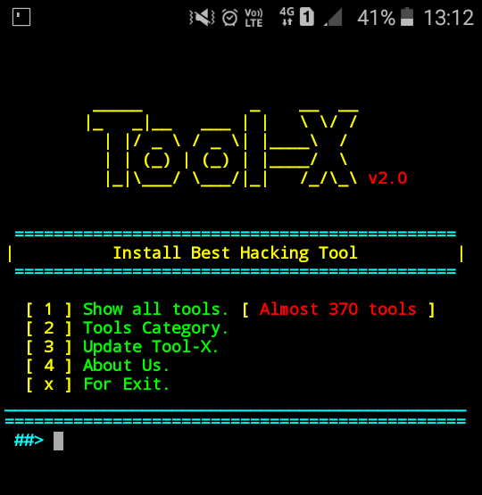
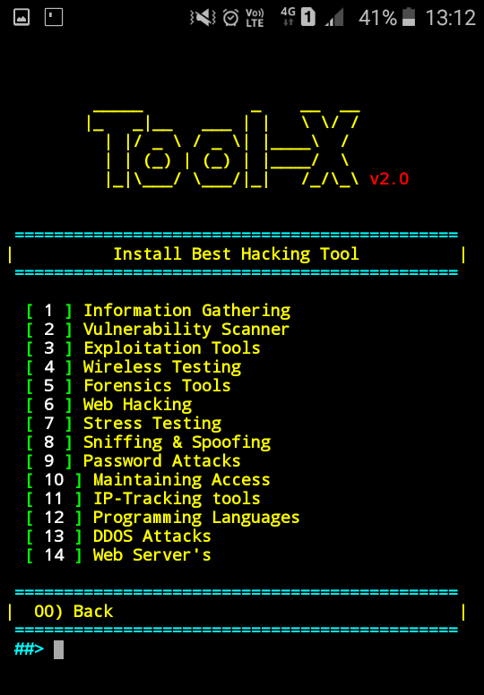
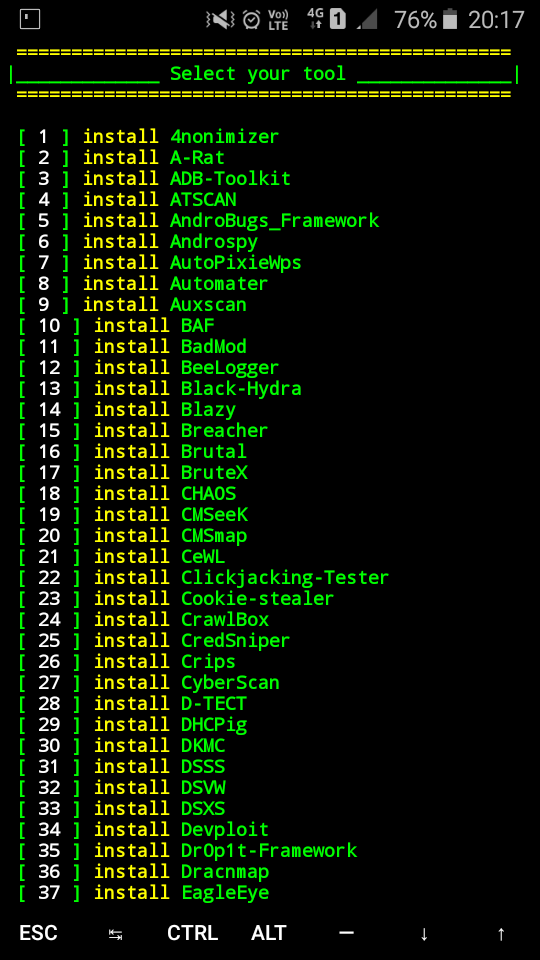

 

-----------------------------------------------------------------
### Operating System Requirements

Tool-X works on any of the following operating systems: 
• **Android** (Using the Termux App)  
• **Linux** (Debian Based Systems)  
• **Unix**

-----------------------------------------------------------------

### How to Install

Open the terminal and type following commands.

* `apt update`

* `apt install git`

* `git clone https://github.com/rajkumardusad/Tool-X.git`

* `cd Tool-X`

* `chmod +x install`

* `sh install` if not work than use `./install`

-----------------------------------------------------------------